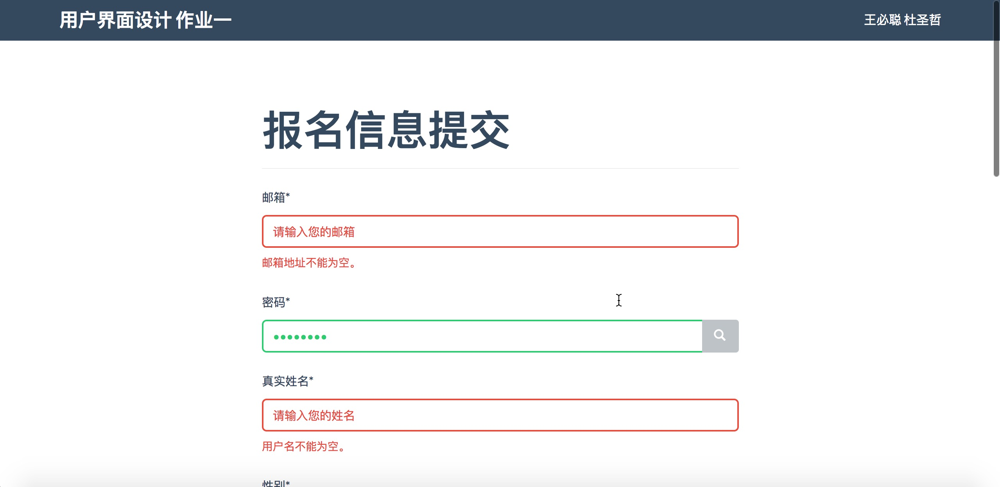
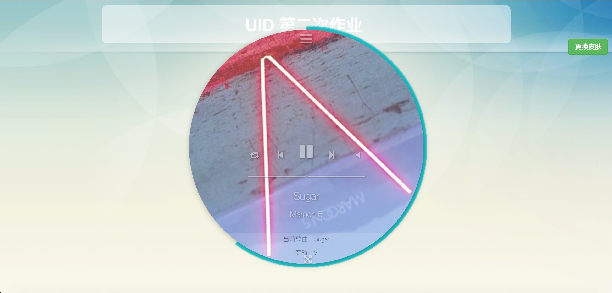

# 用户界面设计

 - 本实验为Web版程序，只在`Chrome`下兼容。  
 - 本实验须在网络环境下运行，因为外部库均使用CDN加速链接。
 
## Project1：填表输入及操作控制界面设计

 - `homework1/index.html`为主页。     
 - `homework1/doc`目录为作业相关文档、UI设计素材等。

## Project2: 个性化用户界面设计

> 本程序是@dusz写的Web版音乐播放器。

 - `homework2/index.html`为主页。    
 - `homework2/doc`目录为作业相关文档等。

## Project3: 网页界面设计

无

## Project（附加）: 智能焦点跳转

